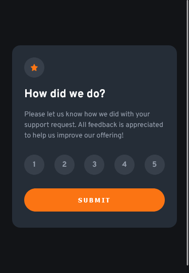

# Frontend Mentor - Interactive rating component solution

This is a solution to the [Interactive rating component challenge on Frontend Mentor](https://www.frontendmentor.io/challenges/interactive-rating-component-koxpeBUmI). Frontend Mentor challenges help you improve your coding skills by building realistic projects. 

## Table of contents

- [Overview](#overview)
  - [The challenge](#the-challenge)
  - [Screenshot](#screenshot)
  - [Links](#links)
- [My process](#my-process)
  - [Built with](#built-with)
  - [What I learned](#what-i-learned)
  - [Continued development](#continued-development)
- [Author](#author)

## Overview

### The challenge

Users should be able to:

- View the optimal layout for the app depending on their device's screen size
- See hover states for all interactive elements on the page
- Select and submit a number rating
- See the "Thank you" card state after submitting a rating

### Screenshot
screencapture on desktop(1440px)

screencapture on mobile(375px)

### Links

- Solution URL: [Github](https://github.com/Neomill/interactive-rating-component-solution)
- Live Site URL: [Github Live Page](https://neomill.github.io/interactive-rating-component-solution/)

## My process

### Built with

- Semantic HTML5 markup
- CSS custom properties
- Flexbox
- Vanilla javascript
- Mobile-first workflow

### What I learned

I learn how to create an interactive rating component

### Continued development

  I like to further my knowledge about web form since rating component in this exercise is an example of web form, I also want to know what is the proper semantic markup use for form.

## Author

- Github - [Neomill](https://github.com/Neomill)
- Frontend Mentor - [@neomill](https://www.frontendmentor.io/profile/Neomill)
- Gmail - [Neomill Marc Reas](rneomillmarc@gmail.com)

